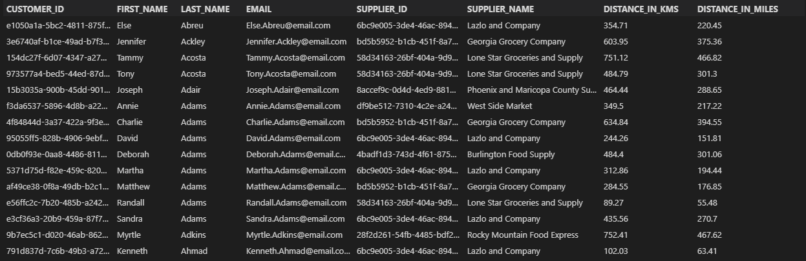

# Week 1 Project

For our first exercise, we need to determine which customers are eligible to order from Virtual Kitchen, and which distributor will handle the orders that they place. We want to return the following information

- Customer ID
- Customer first name
- Customer last name
- Customer email
- Supplier ID
- Supplier name

Shipping distance in kilometers or miles (you choose)

Step 1: We have 10,000 potential customers who have signed up with Virtual Kitchen. If the customer is able to order from us, then their city/state will be present in our database. Create a query in Snowflake that returns all customers that can place an order with Virtual Kitchen.

Step 2: We have 10 suppliers in the United States. Each customer should be fulfilled by the closest distribution center. Determine which supplier is closest to each customer, and how far the shipment needs to travel to reach the customer. There are a few different ways to complete this step. Use the customer's city and state to join to the us_cities resource table. Do not worry about zip code for this exercise.

Order your results by the customer's last name and first name.

Before you submit your solutions to the exercise, please create a brief comment at the top of your SQL query to explain your approach.

## Solution

1. Used CTE to join customer data with customer address table to enrich customer 
2. Performed an inner join between enriched customers and cities from resources table to get eligible customers with their geo location. Joined the two tables on a surrogate key created by joining city and state 
3. Enriched suppliers table with geolocation data by combining with resources_us_cities table
4. Calculated distance bewteen supplier and customer using ST_distance and Performed a cross join
5. kept only the lowest distance to return the final result  

### Query Results:

### Code:
```sql
USE DATABASE VK_DATA;
with cust as (
    Select 
        cd.customer_id
        , cd.first_name
        , cd.last_name
        , cd.email
        , concat(upper(trim(ca.customer_city)),',',upper(trim(ca.customer_state))) as cust_city_state
    from
        customers.customer_data cd
        inner join customers.customer_address ca on ca.customer_id = cd.customer_id
),
cities as (
    select 
        ru.city_id
        , ru.geo_location
        , concat(upper(trim(ru.city_name)),',',upper(trim(ru.state_abbr))) as res_city_state
    from
        resources.us_cities ru
),
supp as (
    select 
        *
        , concat(upper(trim(su.supplier_city)),',',upper(trim(su.supplier_state))) as su_city_state 
    from
    SUPPLIERS.SUPPLIER_INFO su
),

suppliers_geo_coded as (
    select 
        supplier_id
        , supplier_name
        , res_city_state as supplier_city_state
        , cities.geo_location
    from supp
    left join cities on cities.res_city_state = supp.su_city_state
), 

eligible_cust_geo_coded as (
    select 
    cust.customer_id
    , cust.first_name
    , cust.last_name
    , cust.email
    , cities.geo_location
from
    cust 
    inner join cities on cust.cust_city_state = cities.res_city_state
),

final as (
select 
    customer_id
    , first_name
    , last_name
    , email
    , supplier_id
    , supplier_name
    , round(ST_DISTANCE(ecgc.geo_location,sgc.geo_location)/1000,2) as distance_in_kms
    , round(ST_DISTANCE(ecgc.geo_location,sgc.geo_location)/1609,2) as distance_in_miles
from
    eligible_cust_geo_coded ecgc
    cross join suppliers_geo_coded sgc  
qualify row_number() over (partition by customer_id order by distance_in_kms) = 1
)

select * from final order by 3,2;

```