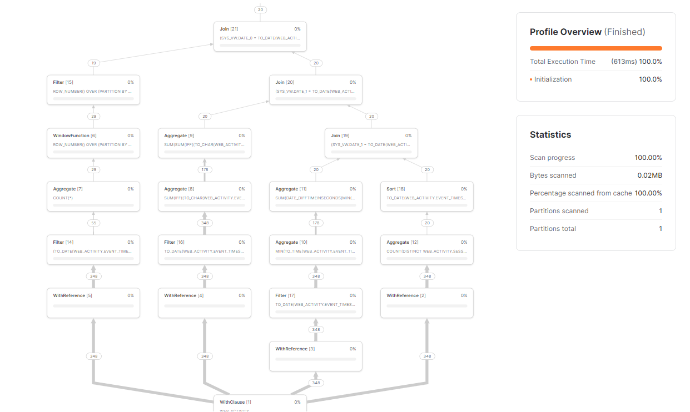
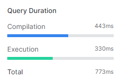
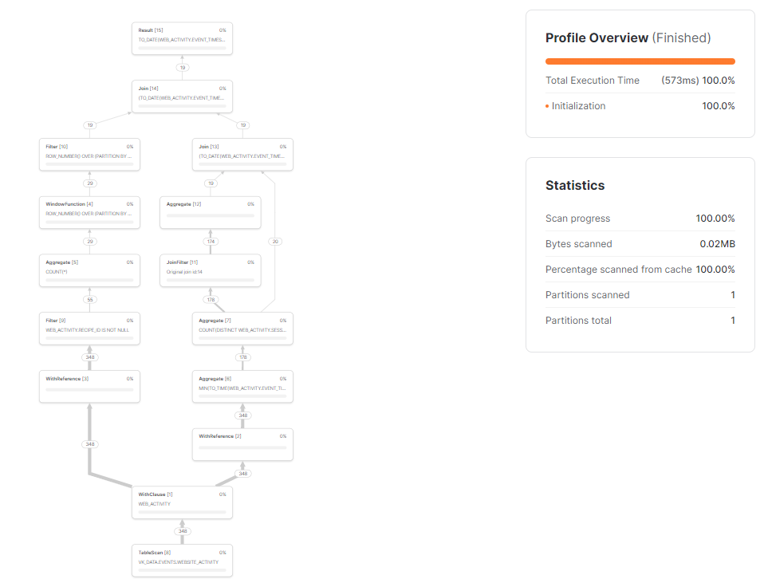
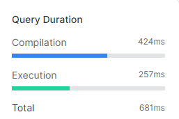

# Week 3 Project
> The Virtual Kitchen developers are making some changes to the search functionality on the website. After gathering customer feedback, they want to change the recipe suggestion algorithm in order to improve the customer experience.
We have a beta version of the website available and have opened it for use by a small number of customers. Next week we plan to increase this number from 200 customers to 5,000. To ensure everything is ready for the test, we have implemented logging and are saving results to a table in Snowflake called _vk_data.events.website_activity_.
>
> The table contains:   
**event_id**: A unique identifier for the user action on the website
**session_id**: The identifier for the user session
**user_id**: The identifier for the logged-in user
**event_timestamp**: Time of the event
**event_details**: Details about the event in JSON — what action was performed by the user?
>
>Once we expand the beta version, we expect the website_activity table to grow very quickly. While it is still fairly small, we need to develop a query to measure the impact of the changes to our search algorithm. Please create a query and review the query profile to ensure that the query will be efficient once the activity increases.  
We want to create a daily report to track:
> - Total unique sessions
> - The average length of sessions in seconds
> - The average number of searches completed before displaying a recipe 
> - The ID of the recipe that was most viewed 
In addition to your query, please submit a short description of what you determined from the query profile and how you structured your query to plan for a higher volume

## Submission:

I wrote 2 versions of the query to understand the query profile. 
- In _version 1_ of the query, each metric was calculated in their respective CTE's and in the end, all the CTE's were joined together. So, in this case there were 4 joins to arrive at the final results.
- In _version 2_ of the query, I combined all the metrics that could be derived together in one single CTE and minimized the number of joins for the final result.

#### Steps taken to plan for higher volumes:
- Selected only the necessary columns
- Used Where conditions to filter out unessary rows
- Minimized the number of joins 
- reduced unnessary table reads by combining CTE's

There was a notable difference in query execution as well as compilation:

 

 

#### version 1:
```sql
with web_activity as (
    select 
        event_id
        , session_id
        , event_timestamp
        , parse_json(event_details):recipe_id as recipe_id
        , parse_json(event_details):page as page
        , parse_json(event_details):event as event_name 
    from
        vk_data.events.website_activity 
),

/* Daily Unique Sessions: */
q1 as (
    select
        event_timestamp::date as date
        , count(distinct session_id)  daily_unique_sessions
    from 
        web_activity
    group by 1
    order by 1 desc
),

/* Calculating Daily Avg Session Length 
Step 1: calculate session duration per session per day
*/
q2_1 as (
    select 
        event_timestamp::date as date
        , session_id
        , TIMESTAMPDIFF(second, min(event_timestamp::time), max(event_timestamp::time)) as session_duration_seconds
    from
        web_activity
    group by 1,2
),

q2_final as (
    select
        date
        , round(avg(session_duration_seconds::int),2) avg_session_duration_seconds
    from q2_1
    group by 1
),
/* Avg number of searches completed before displaying a recipe
- essentially count number of search events in the same session  */
q3_1 as (
    select 
        event_timestamp::date as date
        , session_id
        , count_if(event_name='search') as num_of_searches
    from web_activity
    group by 1,2
),
q3_final as (
    select 
        date 
        , avg(num_of_searches) as avg_no_of_searches
    from
        q3_1
    group by 1
),

/* Most viewed recipe for the day */
q4 as (
    select 
        event_timestamp::date as date
        , recipe_id as top_recipe_id
        , count(*) as no_of_views
    from 
        web_activity
    where recipe_id is not null
    group by 1,2
    qualify 
        row_number() over (partition by date order by no_of_views desc) = 1
),

result as (
    select
        q1.date as date
        , q1.daily_unique_sessions
        , q2.avg_session_duration_seconds
        , q3.avg_no_of_searches
        , q4.top_recipe_id
        , q4.no_of_views
    from
        q1 
        left join q2_final as q2 on q2.date = q1.date 
        left join q3_final as q3 on q3.date = q1.date
        left join q4 on q4.date = q1.date

)
select * from result;
``` 

#### version 2

```sql

with web_activity as (
    select 
        event_id
        , session_id
        , event_timestamp
        , parse_json(event_details):recipe_id as recipe_id
        , parse_json(event_details):event as event_name 
    from
        vk_data.events.website_activity 
),

/* Calculating  
     -  session duration 
    -   number of search events in a session
*/
session_details as (
    select 
        event_timestamp::date as date
        , session_id
        , TIMESTAMPDIFF(second, min(event_timestamp::time), max(event_timestamp::time)) as session_duration_seconds
        , count_if(event_name='search') as num_of_searches
    from
        web_activity
    group by 1,2
),

/* Calculating
    - Daily Unique Sessions
    - Daily avg number of searches completed in a session, assuming a recipe is displayed after
    - Daily avg session duration
*/
session_metrics as (
    select 
        date 
        , count(distinct session_id)  daily_unique_sessions
        , avg(num_of_searches) as avg_no_of_searches
        , round(avg(session_duration_seconds::int),2) avg_session_duration_seconds
    from
        session_details
    group by 1
),

/* Most viewed recipe for the day */
top_recipe as (
    select 
        event_timestamp::date as date
        , recipe_id as top_recipe_id
        , count(*) as no_of_views
    from 
        web_activity
    where recipe_id is not null
    group by 1,2
    qualify 
        row_number() over (partition by date order by no_of_views desc) = 1
),
result as (
    select 
        sm.date
        , daily_unique_sessions
        , avg_no_of_searches
        , avg_session_duration_seconds
        , top_recipe_id
        , no_of_views
    from session_metrics as sm
    inner join top_recipe as tr on tr.date = sm.date 
)

select * from result;
```