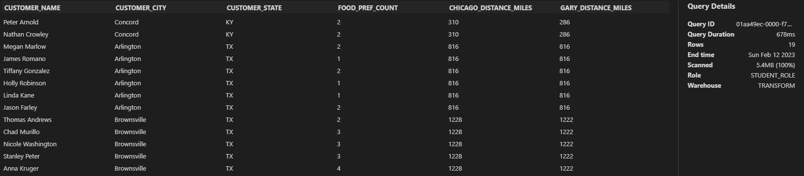
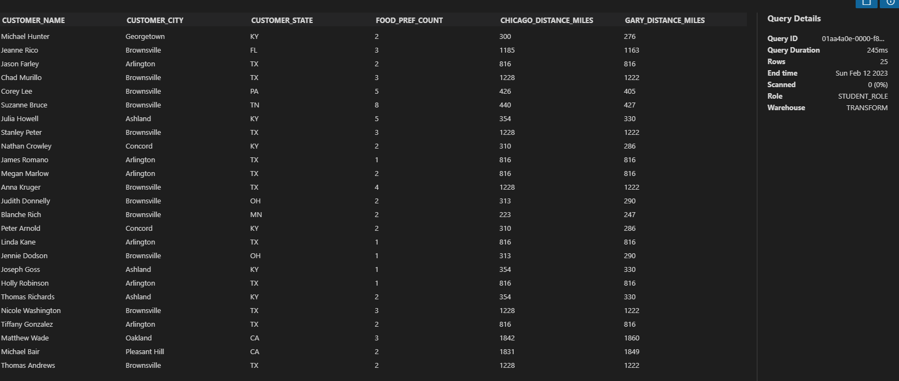

# Week 2 Project: Refactor SQL query to make it more readble
```Virtual Kitchen has an emergency! 

We shipped several meal kits without including fresh parsley, and our customers are starting to complain. We have identified the impacted cities, and we know that 25 of our customers did not get their parsley. That number might seem small, but Virtual Kitchen is committed to providing every customer with a great experience.

Our management has decided to provide a different recipe for free (if the customer has other preferences available), or else use grocery stores in the greater Chicago area to send an overnight shipment of fresh parsley to our customers. We have one store in Chicago, IL and one store in Gary, IN both ready to help out with this request.

Last night, our on-call developer created a query to identify the impacted customers and their attributes in order to compose an offer to these customers to make things right. But the developer was paged at 2 a.m. when the problem occurred, and she created a fast query so that she could go back to sleep.

You review her code today and decide to reformat her query so that she can catch up on sleep.

Here is the query she emailed you. Refactor it to apply a consistent format, and add comments that explain your choices. We are going to review different options in the lecture, so if you are willing to share your refactored query with the class, then let us know!
```

## Solution 
Style choices made during the refactor:
- Used different CTE's to make code modular
- Used lowercase for all keywords to make code more readable
- Used UPPER or LOWER and TRIM to all the string comparisons, to ensure correct matches
- Added table alias to all the column names to easily identify which table the columns are coming from
- Added comments before CTE's
- Personal preference to use leading commas

New query produces 19 impacted customers, while old query produces 25 impacted customers. There is a variance because the way old query was structured, it produced customers outside of 3 affected states (CA, KY and TX)
```sql
/*creating a surrogate key to be used for joining with customers table, while extracting all the cities in the resources table.*/
with all_cities as (
    select
        trim(city_name) as city_name
        , trim(state_abbr) as state_abbr
        , geo_location
        , concat(upper(trim(uc.city_name)),',',upper(trim(uc.state_abbr))) as ac_city_state 
    from 
        vk_data.resources.us_cities uc
),
/*Seperating lat, long coordinates for both Chicago and Gary so that we can use it to calculate the distance from customer later */

chicago_geolocation as (
    select 
        ac.geo_location
    from all_cities ac
    where upper(ac.city_name) = 'CHICAGO' and upper(ac.state_abbr) = 'IL'
),
gary_geolocation as (
    select 
        ac.geo_location
    from all_cities ac 
    where upper(city_name) = 'GARY' and upper(state_abbr) = 'IN'
),
/*Extracting food preferences for active customers */
customer_food_pref as (
    select 
        customer_id,
        count(*)::int as food_pref_count
    from vk_data.customers.customer_survey
    where is_active = true
    group by 1
),
/*Enriching customers data with food preferences and creating a surrogate key to join cities table */
enriched_customer_data as (
    select 
        cd.first_name || ' ' || cd.last_name as customer_name
        , trim(ca.customer_city) as customer_city
        , trim(ca.customer_state) as customer_state
        , cfp.food_pref_count
        , concat(upper(trim(ca.customer_city)),',',upper(trim(ca.customer_state))) as cust_city_state
    from vk_data.customers.customer_data cd
    inner join vk_data.customers.customer_address ca 
            on cd.customer_id = ca.customer_id
    left join customer_food_pref cfp 
            on cfp.customer_id = cd.customer_id
),

/*Extracting the affected customers and enriching them with geo_location coordinates*/
affected_customers as (
    select 
        ecd.*
        , ac.geo_location
    from 
        enriched_customer_data ecd
        left join all_cities ac on ac.ac_city_state = ecd.cust_city_state
    where
        (lower(ecd.customer_city) in ('concord','georgetown','ashland') and lower(ecd.customer_state) = 'ky')
        or (lower(ecd.customer_city) in ('oakland','pleasant hill') and lower(ecd.customer_state) = 'ca')
        or (lower(ecd.customer_city) in ('arlington','brownsville') and lower(ecd.customer_state) = 'tx')
),

/*Extracting Final result set and calculating distance in miles between customer address and our stores */
final as (
    select 
        ac.customer_name
        , ac.customer_city
        , ac.customer_state
        , ac.food_pref_count
        , (st_distance(ac.geo_location, chic.geo_location) / 1609)::int as chicago_distance_miles
        , (st_distance(ac.geo_location, gary.geo_location) / 1609)::int as gary_distance_miles 
    from
        affected_customers ac
        cross join chicago_geolocation as chic
        cross join gary_geolocation as gary  
    where 
        food_pref_count >= 1
)

select * from final ;
```

### Query Results from refactored query :


### Old Query :

```sql
    select 
        first_name || ' ' || last_name as customer_name,
        ca.customer_city,
        ca.customer_state,
        s.food_pref_count,
        (st_distance(us.geo_location, chic.geo_location) / 1609)::int as chicago_distance_miles,
        (st_distance(us.geo_location, gary.geo_location) / 1609)::int as gary_distance_miles
    from vk_data.customers.customer_address as ca
    join vk_data.customers.customer_data c on ca.customer_id = c.customer_id
    left join vk_data.resources.us_cities us 
    on UPPER(rtrim(ltrim(ca.customer_state))) = upper(TRIM(us.state_abbr))
        and trim(lower(ca.customer_city)) = trim(lower(us.city_name))
    join (
        select 
            customer_id,
            count(*) as food_pref_count
        from vk_data.customers.customer_survey
        where is_active = true
        group by 1
    ) s on c.customer_id = s.customer_id
        cross join 
        ( select 
            geo_location
        from vk_data.resources.us_cities 
        where city_name = 'CHICAGO' and state_abbr = 'IL') chic
    cross join 
        ( select 
            geo_location
        from vk_data.resources.us_cities 
        where city_name = 'GARY' and state_abbr = 'IN') gary
    where 
        ((trim(city_name) ilike '%concord%' or trim(city_name) ilike '%georgetown%' or trim(city_name) ilike '%ashland%')
        and customer_state = 'KY')
        or
        (customer_state = 'CA' and (trim(city_name) ilike '%oakland%' or trim(city_name) ilike '%pleasant hill%'))
        or
        (customer_state = 'TX' and (trim(city_name) ilike '%arlington%') or trim(city_name) ilike '%brownsville%')
```

### Query Results from old query :
